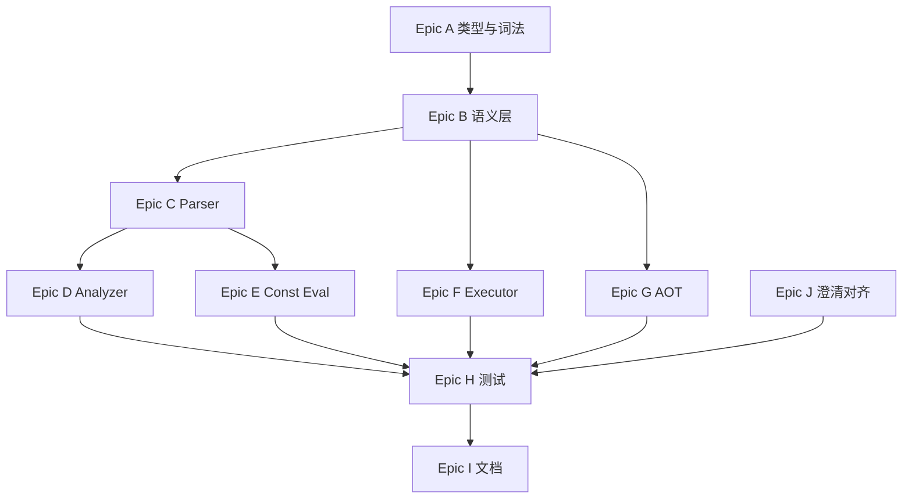

# TC 语言标准 0.0.23 开发任务拆解

> **依据文档**：[TC语言标准设计说明书_0.0.23.md](./TC语言标准设计说明书_0.0.23.md)  
> **当前实现基线**：TC-Compiler `0.0.21`（`src/vm/driver/tc_version.h`）  
> **目标版本**：`0.0.23`  
> **编写日期**：2026-07-06

---

## 1. 背景与范围

0.0.23 相对当前代码库（0.0.21）的**实质新增**主要来自 **0.0.22 位运算特性**；0.0.23 自身以语义澄清与文档修订为主。本文将两类工作统一拆解为可执行的开发任务。

### 1.1 特性增量总览

| 类别 | 0.0.23 内容 | 当前实现状态 |
|------|-------------|--------------|
| **位运算（核心）** | `xor`；`shl`/`shr`；`and`/`or`/`not` 整数重载 | ❌ 未实现 |
| **`shl` + `wrap`** | 左移支持回绕模式 | ❌ 未实现 |
| **移位语义** | 计数不掩码；`k >= n` 规则；同类型操作数 | ❌ 未实现 |
| **let 位运算常量** | 编译期 `and`/`or`/`xor`/`not`/`shl`/`shr` | ❌ 未实现 |
| **关键字错误扩展** | 位运算/shr 禁 `wrap`；`shl` 禁 `truncate` 等 | ⚠️ 部分（仅算术/cast） |
| **§4.4 赋值初始化** | 对未初始化变量赋值视为初始化 | ✅ 已实现（`last_init`） |
| **§8.5 cast 澄清** | `truncate` 仅整数→整数 | ⚠️ 需核对 parser/analyzer |
| **文档同步** | 主标准说明书升至 0.0.23 | ❌ 主文档仍为 0.0.21 |

### 1.2 不在本次范围

附录 D 扩展路线图中的浮点、控制流、函数、数组/指针等**预留特性**不在 0.0.23 实现范围内。

---

## 2. 架构决策（实施前确认）

### 2.1 `and`/`or`/`not` 重载策略

标准规定：类型参数为整数 → 按位运算；类型参数为 `bool` → 逻辑运算（含短路）。

**推荐方案**（与现有 `TC_TOK_LOGIC_OP` 最小冲突）：

1. Parser 在 `and`/`or`/`not` 后**先读类型参数**，再分派：
   - `bool` → 现有 `TC_RHS_LOGIC_BIN` / `TC_RHS_LOGIC_UN`
   - 整数类型 → 新增 `TC_RHS_BITWISE_BIN` / `TC_RHS_BITWISE_UN`
2. `xor` 仅允许整数类型参数 → `TC_RHS_BITWISE_BIN`
3. Lexer 为 `xor`/`shl`/`shr` 增加独立 token（或归入统一的 `TC_TOK_BITWISE_OP` / `TC_TOK_SHIFT_OP`）

### 2.2 新增 `TcRhsKind`（建议）

| Kind | 语义 | let 支持 |
|------|------|----------|
| `TC_RHS_BITWISE_BIN` | `and`/`or`/`xor`(int, a, b) | ✅ |
| `TC_RHS_BITWISE_UN` | `not`(int, a) | ✅ |
| `TC_RHS_SHIFT` | `shl`/`shr`(int [,wrap,] val, cnt) | ✅（禁 wrap） |

实施后须同步 **8 处分发点** + `check_rhs_coverage.py` 枚举表 + `@knowledge-graph`。

### 2.3 语义实现位置

| 运算 | 实现函数（建议） | 文件 |
|------|------------------|------|
| 按位 and/or/xor/not | `tc_exec_bitwise_binary` / `tc_exec_bitwise_unary` | `tc_semantics.c` |
| shl/shr | `tc_exec_shift` | `tc_semantics.c` |
| AOT shim | `tc_aot_bitwise_*` / `tc_aot_shift` | `tc_aot_rt.c` |

---

## 3. Epic 任务拆解

### Epic A — 类型模型与词法（P0）

#### A-1：`tc_types.h` 扩展枚举与 AST

- [ ] 新增 `TcBitwiseOp`：`TC_BIT_AND`、`TC_BIT_OR`、`TC_BIT_XOR`
- [ ] 新增 `TcShiftOp`：`TC_SHIFT_SHL`、`TC_SHIFT_SHR`
- [ ] 新增 `TcRhsKind`：`TC_RHS_BITWISE_BIN`、`TC_RHS_BITWISE_UN`、`TC_RHS_SHIFT`
- [ ] 在 `TcRhs` union 中增加对应字段（含 `TcIntType type`、`TcWrapMode mode`（仅 shl）、操作数）
- [ ] 更新 `tc_rhs_free` 相关结构体注释

**验收**：`tc_types.h` 可独立编译；命名符合 `coding-standards`。

#### A-2：`tc_types.c` 解析辅助

- [ ] `tc_bitwise_op_parse("and"|"or"|"xor")`
- [ ] `tc_shift_op_parse("shl"|"shr")`
- [ ] 各 `tc_*_op_name()` 字符串化（诊断/AOT 用）

#### A-3：Lexer 关键字

- [ ] `tc_keyword_token()` 识别 `xor`、`shl`、`shr`
- [ ] 新增 `TC_TOK_BITWISE_OP`（xor）与 `TC_TOK_SHIFT_OP`（shl/shr），或扩展 token union
- [ ] `tc_token_to_string()` 覆盖新 token
- [ ] 确认 `and`/`or`/`not` 仍映射为 `TC_TOK_LOGIC_OP`（parser 按类型参数分派）

**验收**：`0b1010_1010u`、`xor`、`shl(int8, a, 2)` 可正确 tokenize。

---

### Epic B — 位运算语义层（P0）

#### B-1：按位逻辑 `tc_exec_bitwise_*`

文件：`src/vm/runtime/tc_semantics.c`、`tc_semantics.h`

- [ ] **双目** `tc_exec_bitwise_binary(TcBitwiseOp, TcIntType, lhs, rhs, out, diag, line)`
  - 操作数按无符号位模式处理，结果按目标类型解释（§6.1.3）
  - 不检测溢出，不支持 `wrap`/`truncate`
- [ ] **单目** `tc_exec_bitwise_unary(TcBitwiseOp, TcIntType, operand, out, diag, line)`
  - `not` 按位取反
- [ ] 操作数类型须与 `T` 一致（由 analyzer 保证，semantics 做防御检查）

**验收**：单元测试覆盖 8 种整数类型的 and/or/xor/not 边界用例。

#### B-2：移位 `tc_exec_shift`

- [ ] **左移 `shl`**（§6.2.1）：
  - 计数 `k` 取无符号数学值，**不掩码**
  - `k >= n`：严格模式 → `TC_ERR_OVERFLOW`；`wrap` 模式 → `0`
  - `k < n` 严格模式：检测 `val * 2^k` 是否超范围
  - `k < n` wrap 模式：取低 `n` 位，不报错
  - 被移位数为 `0` → 结果 `0`
- [ ] **右移 `shr`**（§6.2.2）：
  - `k >= n` → `0`
  - 有符号算术右移；无符号逻辑右移
  - 永不溢出，不接受 `wrap`
- [ ] 负数移位计数（有符号 `k`）：按无符号解释为大正数处理（§6.2.3）

**验收**：对照标准示例 §10.21、`§6.2` 边界表（`shl(127,2)` 溢出、`shr(-128,1)=-64` 等）。

#### B-3：关键字错误（运行时/解析期）

- [ ] `div`/`mod`/`abs` + `wrap` → 已有，保持
- [ ] `and`/`or`/`xor`/`not`/`shr` + `wrap` → `TC_ERR_KEYWORD`
- [ ] `shl` + `truncate` → `TC_ERR_KEYWORD`
- [ ] `cast` + `wrap` → 已有，保持
- [ ] `neg` + `wrap` 合法；`abs` + `wrap` 非法

---

### Epic C — Parser 与 RHS 分发（P0）

#### C-1：运行时 RHS 解析

文件：`src/vm/parser/tc_parser.c`

- [x] `tc_parse_bitwise_bin_rhs()` — `and`/`or`/`xor`(int_type, op1, op2)
- [x] `tc_parse_bitwise_un_rhs()` — `not`(int_type, op)
- [x] `tc_parse_shift_rhs()` — `shl`(int [,wrap,] val, cnt) / `shr`(int, val, cnt)
- [x] 重构 `tc_parse_rhs()`：
  - `TC_TOK_LOGIC_OP` + 整数类型 → 位运算路径
  - `TC_TOK_LOGIC_OP` + `bool` → 逻辑路径（保持现状）
  - `TC_TOK_BITWISE_OP` / `TC_TOK_SHIFT_OP` → 对应路径
- [x] `xor(bool, ...)` → 类型错误（analyzer 或 parser 阶段）

#### C-2：常量 RHS 解析

- [x] `tc_parse_const_bitwise_*()` / `tc_parse_const_shift_rhs()`
- [x] `tc_parse_const_rhs()` 分派位运算/移位
- [x] let 路径禁止 `wrap`（`shl` 常量溢出即 `TC_ERR_CONST_OVERFLOW`）
- [x] `shr` 常量 `k >= n` 不报错，结果为 `0`

#### C-3：`tc_rhs_free` 与深度限制

- [x] 新 kind 的动态内存释放
- [x] `TC_PARSER_MAX_DEPTH` 行为不变

#### C-4：分发点同步

- [x] 更新 `scripts/sync/check_rhs_coverage.py` 中 `TC_RHS_KINDS` 列表
- [ ] 运行 `python3 scripts/sync/check_rhs_coverage.py` 通过
- [x] 更新 `.cursor/rules/knowledge-graph.mdc` 分发点表（可用 `--fix`）

**验收**：附录 A EBNF 中 `bitwise_expr`、`unary_bitwise_expr`、`shift_expr` 产生式均可解析。

---

### Epic D — 静态分析（P0）

文件：`src/vm/analyzer/tc_analyzer.c`

#### D-1：`tc_check_rhs` 扩展

- [ ] `TC_RHS_BITWISE_BIN` / `TC_RHS_BITWISE_UN`：
  - 类型参数须为整数（非 `bool`）
  - 操作数类型与 `T` 一致
  - 结果类型 = `T`
  - 未初始化变量警告（同算术）
- [ ] `TC_RHS_SHIFT`：
  - 被移位数与计数须同类型 `T`（§6 重要约束）
  - 结果类型 = `T`
  - `shr` 若出现 `wrap` 关键字 → 关键字错误（parser 层拦截更佳）

#### D-2：赋值与关键字

- [ ] 位运算结果赋值类型检查
- [ ] `xor` 用于 `bool` 上下文 → `TC_ERR_TYPE_MISMATCH`

**验收**：静态错误测试（类型不匹配、关键字误用）在 Pass2 正确报错。

---

### Epic E — 编译期常量求值（P0）

文件：`src/vm/analyzer/tc_const_eval.c`

#### E-1：`tc_eval_const_rhs` 扩展

- [ ] 按位运算：委托 `tc_exec_bitwise_*`（或内联等价逻辑）
- [ ] 移位：
  - `shl` 严格模式溢出 → `TC_ERR_CONST_OVERFLOW`
  - `shl` 禁止 `wrap`
  - `shr` `k >= n` → `0`
- [ ] 常量 `shl` 且 `k >= n` → 常量溢出错误（§6.2.3）

#### E-2：常量引用链

- [ ] `let COMBINED = or(uint8, HIGH, LOW)` 等引用链可求值
- [ ] 循环依赖检测保持有效

**验收**：§4.3 / §10.20 / §10.21 中 let 示例可编译；ERR6~ERR9 类用例报错。

---

### Epic F — 运行时执行（P0）

文件：`src/vm/executor/tc_executor.c`

#### F-1：`tc_eval_rhs` 扩展

- [ ] `TC_RHS_BITWISE_BIN` → `tc_exec_bitwise_binary`
- [ ] `TC_RHS_BITWISE_UN` → `tc_exec_bitwise_unary`
- [ ] `TC_RHS_SHIFT` → `tc_exec_shift`

#### F-2：逻辑运算不受影响

- [ ] `and`/`or`/`not` + `bool` 短路行为保持（§7.2）
- [ ] 位运算无短路

**验收**：§10.21 运行时示例输出与期望一致。

---

### Epic G — AOT 代码生成（P0）

文件：`src/aot/tc_aot_codegen.c`、`src/aot/tc_aot_rt.c`

#### G-1：`tc_aot_emit_rhs`

- [ ] 为新 `TcRhsKind` 生成 C 调用或内联表达式
- [ ] `shl` wrap 模式传递 `TC_ARITH_WRAP` 等价物

#### G-2：Runtime shim

- [ ] `tc_aot_bitwise_binary/unary` → 委托 `tc_exec_bitwise_*`
- [ ] `tc_aot_shift` → 委托 `tc_exec_shift`
- [ ] `check_rhs_coverage.py` shim 存在性检查通过

#### G-3：AOT 差分测试

- [ ] 新用例加入 `scripts/aot/run_tests.sh`
- [ ] `make test-aot` 全通过

---

### Epic H — 测试（P0）

#### H-1：VM 集成测试（`tests/`）

按 `tests-tc` 约定，每个 static 文件一种错误；valid 覆盖语义。

**Valid 用例（建议文件名）**：

| 测试名 | 覆盖点 |
|--------|--------|
| `bitwise_and_or_xor_not_valid` | 按位四运算 8 类型抽样 |
| `bitwise_shift_shl_shr_valid` | 严格 shl、算术/逻辑 shr |
| `bitwise_shl_wrap_valid` | `shl(T, wrap, ...)` 回绕 |
| `bitwise_shift_k_ge_n_valid` | `shr`/`shl(wrap)` 当 `k >= n` |
| `bitwise_let_const_valid` | let 编译期位运算 |
| `bitwise_io_format_valid` | `%b`/`%x` 输出位运算结果 |

**Static 用例（建议）**：

| 测试名 | 错误类型 |
|--------|----------|
| `bitwise_xor_bool_type_error` | 类型错误 |
| `bitwise_wrap_on_shr_keyword_error` | 关键字错误 |
| `bitwise_wrap_on_and_keyword_error` | 关键字错误 |
| `bitwise_shl_truncate_keyword_error` | 关键字错误 |
| `bitwise_shift_type_mismatch` | 操作数类型不一致 |
| `bitwise_shl_overflow_runtime` | 整数溢出（runtime） |
| `bitwise_shl_const_overflow` | 常量溢出 |
| `bitwise_let_wrap_forbidden` | 常量表达式错误 |

- [ ] 全部注册 `scripts/vm/run_tests.sh`
- [ ] `bash scripts/run_tests.sh --filter bitwise` 通过

#### H-2：C 单元测试（`tests/unit/runtime/`）

- [ ] `test_bitwise.c`：`tc_exec_bitwise_*` 位模式边界
- [ ] `test_shift.c`：`k>=n`、负数计数、INT_MIN 左移等
- [ ] 注册 `tests/unit/CMakeLists.txt`

#### H-3：回归

- [ ] `make test` 全量通过（VM + unit + AOT）
- [ ] `python3 scripts/sync/check_source_naming.py` 通过

---

### Epic I — 文档同步（P1）

#### I-1：语言标准

- [ ] 将 `docs/TC语言标准设计说明书.md` 同步至 0.0.23 内容（或以 `_0.0.23.md` 为源合并）
- [ ] 版本号与附录 E 修订记录一致

#### I-2：工程文档

- [ ] `src/vm/driver/tc_version.h` → `"0.0.23"`
- [ ] `tc-architecture/syntax.md`：补充位运算产生式
- [ ] `tc-architecture/features.md`：位运算→文件/函数映射
- [ ] `tc-architecture/errors.md`：新静态/运行时错误子串
- [ ] `.cursor/rules/knowledge-graph.mdc`：特性→测试映射
- [ ] `docs/TC-VM详细设计说明书.md`：流水线/RHS kind 列表（若引用）
- [ ] `docs/TC-AOT详细设计说明书.md`：新 shim 函数（若引用）
- [ ] `README.md`：测试规模数字更新

#### I-3：合规审查

- [ ] 更新 `docs/设计实现合规审查报告.md` 位运算章节

---

### Epic J — 0.0.23 语义澄清对齐（P1）

以下为 0.0.23 修订项，**多数仅需文档或轻量核对**：

| 任务 | 说明 | 动作 |
|------|------|------|
| J-1 | §5.1 `wrap` 适用范围含 `shl` | 更新概述/注释；parser 仅在 `shl` 接受 wrap |
| J-2 | §8.5 `truncate` 仅整数→整数 | 核对 `tc_parse_cast_rhs`：`bool` 目标禁 `truncate` |
| J-3 | §4.4 赋值初始化未初始化变量 | 已实现；补测试 `assign_uninit_var_valid`（可选） |
| J-4 | §5.2 `mod` 不因子值不可表示报错 | 文档/注释对齐，通常无需改代码 |
| J-5 | §6.2 移位操作数同类型 | analyzer 强制检查 |
| J-6 | 附录 B `mod(INT_MIN,-1)` 对照 | 文档已更新；确认现有测试覆盖 |

---

## 4. 推荐实施顺序

**里程碑建议**：

1. **M1**：A + B 完成，单元测试 `test_bitwise`/`test_shift` 绿
2. **M2**：C + D + E + F 完成，VM valid/static 位运算测试绿
3. **M3**：G 完成，AOT 差分绿
4. **M4**：I + J，版本号 0.0.23，全量 `make test` 绿

---

## 5. 验收标准（Definition of Done）

- [ ] 标准 §6 位运算与 §6.3 常量位运算语义与实现一致
- [ ] `and`/`or`/`not` 在 `bool` 与整数上下文行为正确且无回归
- [ ] 8 处 `TcRhsKind` 分发点 + `check_rhs_coverage.py` 通过
- [ ] VM + unit + AOT 测试全通过
- [ ] `docs/TC语言标准设计说明书.md` 版本 0.0.23
- [ ] `TC_VM_VERSION` 为 `0.0.23`
- [ ] 知识图谱与 `features.md` 已同步

---

## 6. 任务清单速查（按文件）

| 文件 | 任务 ID |
|------|---------|
| `src/vm/runtime/tc_types.h` | A-1 |
| `src/vm/runtime/tc_types.c` | A-2 |
| `src/vm/lexer/tc_lexer.c` | A-3 |
| `src/vm/runtime/tc_semantics.c` | B-1, B-2 |
| `src/vm/parser/tc_parser.c` | B-3, C-1, C-2, C-3 |
| `src/vm/analyzer/tc_analyzer.c` | D-1, D-2 |
| `src/vm/analyzer/tc_const_eval.c` | E-1, E-2 |
| `src/vm/executor/tc_executor.c` | F-1 |
| `src/aot/tc_aot_codegen.c` | G-1 |
| `src/aot/tc_aot_rt.c` | G-2 |
| `scripts/sync/check_rhs_coverage.py` | C-4 |
| `scripts/vm/run_tests.sh` | H-1 |
| `tests/unit/runtime/test_bitwise.c` | H-2 |
| `tests/unit/runtime/test_shift.c` | H-2 |
| `docs/TC语言标准设计说明书.md` | I-1 |
| `src/vm/driver/tc_version.h` | I-2 |

---

## 7. 风险与注意事项

1. **`and`/`or`/`not` 歧义**：必须在 parser 读类型参数后分派，不可仅按 token 种类路由。
2. **移位计数不掩码**：与 C 语义不同，单元测试须显式覆盖 `k == n`、`k > n`。
3. **AOT 与 VM 一致性**：位运算必须委托 `tc_semantics.c`，禁止在 codegen 重复实现。
4. **let 与 wrap**：常量 `shl` 溢出报 `TC_ERR_CONST_OVERFLOW`，不是运行时 `TC_ERR_OVERFLOW`。
5. **测试注册**：新增 static 文件必须加入 `run_tests.sh`，否则 CI 不执行。

---

## 8. 参考

- 标准正文：[TC语言标准设计说明书_0.0.23.md](./TC语言标准设计说明书_0.0.23.md) §6、§4.3、附录 A
- 实施 Skill：`add-compiler-feature` → `feature-kinds.md` §3 / §5
- 分发点：`@knowledge-graph` §TcRhsKind
- 测试约定：Rule `tests-tc`、`test-patterns`

---

*本文档随实现进度更新任务勾选状态。*
