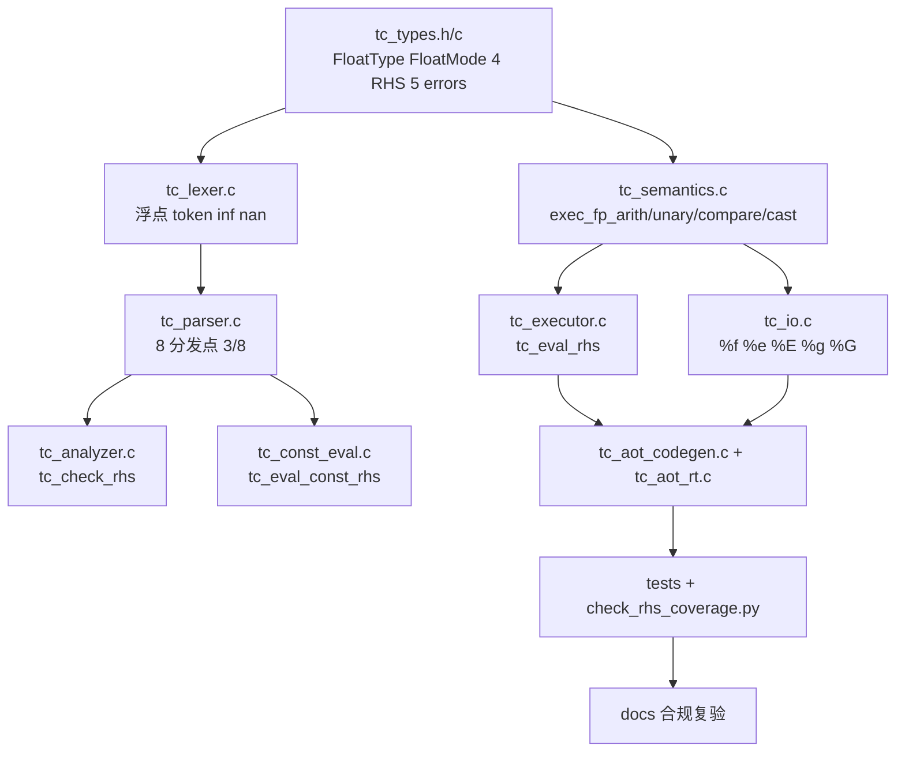

# TC-Compiler v0.0.25 开发与测试计划

> **计划周期**：2026-07-13（周一）～ 2026-07-17（周五）  
> **目标版本**：v0.0.25 — 浮点类型 `float32`/`float64` 全链路  
> **依据文档**：[TC语言标准设计说明书.md](./TC语言标准设计说明书.md) v0.0.25 · [TC-VM详细设计说明书.md](./TC-VM详细设计说明书.md) · [TC-AOT详细设计说明书.md](./TC-AOT详细设计说明书.md) · [libtc设计说明书.md](./libtc设计说明书.md)  
> **知识图谱**：`@knowledge-graph`（8 分发点 / let / 短路 / 重载 / 流水线）  
> **当前基线**：代码 v0.0.24（282 VM / 140 AOT / 659 unit）；文档已先行更新至 v0.0.25 草案

---

## 1. 背景与差距分析

### 1.1 已完成（v0.0.24 基线）

| 模块 | 状态 | 证据 |
|------|------|------|
| 整数 + bool 全链路 | ✅ | 282 VM 全通过 |
| 位运算 / 移位 | ✅ | 12 种 `TcRhsKind`；`check_rhs_coverage.py` 12×8 |
| if 控制流 / 块作用域 | ✅ | 7 种 `TcStmtKind`；缩进 R1–R6 |
| 内存安全 / CI 基础设施 | ✅ | ASan / UBSan / Valgrind / `scripts/ci.sh` |
| 文档 v0.0.25 草案 | ✅（未提交） | 7 份 docs 已修订；合规报告 347 项表已起草 |

### 1.2 待实现（v0.0.25 核心差距）

| 差距项 | 设计位置 | 代码现状 |
|--------|----------|----------|
| `float32`/`float64` 类型枚举 | 标准 §3.3；VM §3.1 | `tc_types.h` 无浮点类型 |
| 浮点字面量 / `inf`/`nan` 词法 | 标准 §2.4；VM §5.1 | `TcLiteral` 无 `is_float` |
| 4 个新 `TcRhsKind` | VM §3.2；AOT §4.4 | 仅 12 种 Kind |
| `FloatMode`（strict/ieee/wrap） | 标准 §5.1；VM §10.9 | 无 `TC_FLOAT_*` 枚举 |
| 5 个新错误码 | 标准 §11.4；VM §11.3 | 无 `TC_ERR_FLOAT_*` / `MODE_MISMATCH` |
| `exec_fp_*` 语义层 | VM §10.9–10.11 | `tc_semantics.c` 无浮点函数 |
| I/O `%f`/`%e`/`%E`/`%g`/`%G` | 标准 §9.4；VM §17 | `tc_io.c` 仅 8 种格式 |
| AOT 4 个 fp shim | AOT §5.2 | `tc_aot_rt.c` 无 fp 入口 |
| 浮点测试用例 | AOT §9.6 | `tests/` 无 `fp_*.tc` |
| 版本号 | `tc_version.h` | 仍为 `"0.0.24"` |

### 1.3 交付定义（周五验收）

1. **功能**：语言标准 §3.3、§5.7、§7.1、§8.4、§9 所列浮点能力在 VM / AOT / libtc 三路径一致可用  
2. **分发点**：16 种 `TcRhsKind` × 8 分发点全覆盖（`check_rhs_coverage.py` 通过）  
3. **测试**：VM ≥310、AOT ≥155、unit ≥700；`make test` + `scripts/ci.sh` 全绿  
4. **文档**：docs 与代码对齐；合规审查报告复验 ≥347 项  
5. **版本**：`TC_VM_VERSION` → `"0.0.25"`；`@knowledge-graph` / `AGENTS.md` / `test-map.md` 同步

---

## 2. 架构与实施路径（知识图谱）

### 2.1 编译流水线（不变）

```
types → lexer → parser → analyzer(+const_eval) → semantics/io → executor → aot → tests
```

浮点为 **跨层特性**，按上序逐层推进；**禁止**跳层或仅改 executor。

### 2.2 新增 TcRhsKind（L2 必改 8 分发点）

| # | 函数 | 文件 | 浮点变更 |
|---|------|------|----------|
| 1 | `tc_parse_rhs` | `parser/tc_parser.c` | 类型参数 `float32`/`float64` → `FLOAT_*` 分支 |
| 2 | `tc_parse_const_rhs` | `parser/tc_parser.c` | let 禁 `ieee`/`wrap`；浮点字面量操作数 |
| 3 | `tc_rhs_free` | `parser/tc_parser.c` | 4 个新 union 成员释放 |
| 4 | `tc_check_rhs` | `analyzer/tc_analyzer.c` | 类型约束；`mod` 禁浮点；`ieee` 禁整数 |
| 5 | `tc_eval_const_rhs` | `analyzer/tc_const_eval.c` | `float64` 精度编译期求值 |
| 6 | `tc_eval_rhs` | `executor/tc_executor.c` | 分发 → `tc_exec_fp_*` |
| 7 | `tc_aot_emit_rhs` | `aot/tc_aot_codegen.c` | 4 case + 字面量位模式嵌入 |
| 8 | shim | `aot/tc_aot_rt.c` | `tc_aot_fp_arith/unary/compare/cast` → semantics |

新增 Kind：`FLOAT_ARITH` · `FLOAT_UNARY` · `FLOAT_COMPARE` · `FLOAT_CAST`

> **注意**：整数 `CAST` 与浮点 `FLOAT_CAST` 分 Kind 维护；运行时 cast 源须为变量（与整数一致）。

### 2.3 类型解析分派（Parser 关键逻辑）

```
tc_parse_type_token():
  float32 / float64 → FloatType
  int8..uint64 / bool → IntType（现有）

tc_parse_arith_or_compare_rhs(type):
  整数类型 → ARITH/UNARY/COMPARE（现有）
  浮点类型 → FLOAT_ARITH/FLOAT_UNARY/FLOAT_COMPARE
  mod + 浮点 → Parser 或 Analyzer 拒绝

tc_parse_mode_keyword(type):
  整数 → wrap（现有 TcWrapMode）
  浮点 → ieee / wrap（TcFloatMode）；strict 为默认
```

### 2.4 整数/浮点隔离原则（知识图谱 §重载 扩展）

| 场景 | 整数路径 | 浮点路径 |
|------|----------|----------|
| `and`/`or`/`not` | `BITWISE_*`（无短路） | **不支持** → 类型错误 |
| `shl`/`shr`/`xor` | `SHIFT`/`BITWISE_BIN` | **不支持** |
| `mod` | `ARITH` | **不支持** |
| `ieee` 模式 | **不支持** → `MODE_MISMATCH` | `FLOAT_*` |
| `wrap` 于比较 | **不支持** | **不支持** |
| let 常量 | 禁 wrap | 禁 ieee/wrap；`float64` 精度 |

### 2.5 依赖关系图



---

## 3. 分层开发清单

### 3.1 类型系统 — `tc_types.h` / `tc_types.c`

- [ ] `TC_FLOAT32` / `TC_FLOAT64` 加入类型枚举（或独立 `TcFloatType`，与 VM 详设 §3.1 对齐）
- [ ] `TcFloatMode`：`TC_FLOAT_STRICT` / `TC_FLOAT_IEEE` / `TC_FLOAT_WRAP`
- [ ] `TcLiteral.is_float` + 浮点 magnitude 编码策略（IEEE bits 或 double 暂存，与 lexer 约定）
- [ ] AST union 扩展 4 个浮点 RHS 结构体
- [ ] 5 个错误码：`TC_ERR_FLOAT_OVERFLOW` / `UNDERFLOW` / `INVALID` / `FLOAT_CAST_OVERFLOW` / `MODE_MISMATCH`
- [ ] `tc_type_is_float()` / `tc_type_bit_width()` 扩展
- [ ] `tc_error_kind_name()` + `test_types.c` 新枚举测试
- [ ] 标准 §11.4 对照表已在 docs 中，实现后复验一致

### 3.2 词法 — `tc_lexer.c`

- [ ] 浮点字面量：`.` / `e`/`E` / `f`/`F` 后缀 / 科学计数法
- [ ] 特殊值：`inf` / `-inf` / `nan` → `TC_TOK_FLOAT_LIT` 或专用 token
- [ ] 关键字：`float32` / `float64` / `ieee`（`tc_keyword_token`）
- [ ] 词法错误：`3.14u`、纯整数上下文误用浮点字面量
- [ ] `float32` 范围溢出静态拒绝
- [ ] 单元：`test_lexer.c` / `test_lexer_extended.c` 增补（目标 +30 case）

### 3.3 语法 — `tc_parser.c`

- [ ] `tc_parse_type_token` 识别浮点类型
- [ ] `tc_parse_rhs` / `tc_parse_const_rhs`：4 浮点 Kind 分支
- [ ] 模式关键字：`ieee`/`wrap` 上下文检查（浮点 vs 整数）
- [ ] `tc_rhs_free` / `tc_operand_free` 浮点路径
- [ ] cast：`cast(float64, x)` / `cast(int32, truncate, f)` 分派
- [ ] 单元：`test_parser.c` 增补（目标 +15 case）

### 3.4 静态分析 — `tc_analyzer.c`

- [ ] `tc_check_rhs` 4 浮点分支
- [ ] 字面量范围：`tc_check_literal_for_type` 扩展 float
- [ ] I/O 格式：`tc_check_io_format` 新增 F/E/EU/G/GU
- [ ] `mod` 浮点 → `TYPE_MISMATCH`；整数 + `ieee` → `MODE_MISMATCH`
- [ ] 浮点比较可选 `ieee`（与整数比较禁模式区分，标准 §7.1.1）
- [ ] 单元：`test_analyzer.c` 增补

### 3.5 常量求值 — `tc_const_eval.c`

- [ ] `tc_eval_const_rhs`：`FLOAT_ARITH/UNARY/COMPARE/CAST`
- [ ] 中间一律 `float64` 精度；写入 `float32` 前向偶舍入
- [ ] 禁 `ieee`/`wrap` → 映射 `TC_ERR_CONSTANT_*`
- [ ] 溢出/除零/无效 → `tc_const_map_runtime_error`
- [ ] 单元：经 `test_analyzer.c` 或新建 const_eval 用例覆盖

### 3.6 语义 — `tc_semantics.c`

- [ ] `tc_exec_fp_arith(op, type, mode, lhs, rhs, out, diag, line)`
- [ ] `tc_exec_fp_unary(op, type, mode, operand, out, diag, line)`
- [ ] `tc_exec_fp_compare(op, type, mode, lhs, rhs, out, diag, line)`
- [ ] `tc_exec_fp_cast(target, mode, src, out, diag, line)`
- [ ] strict：`fetestexcept` 检查后映射 4 类浮点错误
- [ ] ieee：直接 C 运算
- [ ] wrap：bits 作 uint32/uint64 整数运算（VM 详设 §10.9 表）
- [ ] NaN 比较规则（VM 详设 §10.10）
- [ ] truncate 位重解释：`float32`↔`int32`、`float64`↔`int64`
- [ ] 单元：`test_semantics.c` 增补（目标 +40 case）

### 3.7 I/O — `tc_io.c`

- [ ] `TcFormatSpec` 扩展：`F` / `E` / `EU` / `G` / `GU`
- [ ] `tc_io_write_value` / `tc_io_read_value` 支持 float32/float64
- [ ] 单元：`test_io.c` 增补（目标 +10 case）

### 3.8 执行器 — `tc_executor.c`

- [ ] `tc_eval_rhs` 4 浮点 case → 委托 `tc_exec_fp_*`
- [ ] 浮点字面量 slot 写入（bits 编码）
- [ ] if 块内浮点变量：块作用域逻辑不变

### 3.9 AOT — `tc_aot_codegen.c` / `tc_aot_rt.c`

- [ ] `tc_aot_emit_rhs` 4 case
- [ ] 浮点字面量：`tc_aot_lit(TC_FLOAT64, bits, …)` 位模式直嵌
- [ ] 4 shim：`tc_aot_fp_arith/unary/compare/cast` → `tc_exec_fp_*`
- [ ] let 编译期折叠：浮点 const 位模式嵌入
- [ ] 差分：新增 fp 用例 stdout 逐字节对齐

### 3.10 版本与元数据

- [ ] `src/vm/driver/tc_version.h` → `"0.0.25"`
- [ ] `.cursor/rules/knowledge-graph.mdc`：16 Kind、浮点子图
- [ ] `AGENTS.md` / `features.md` / `test-map.md` / `errors.md`
- [ ] 提交已修订 docs（7 文件）

---

## 4. 测试计划

### 4.1 测试金字塔

| 层级 | 目标增量 | 命令 | 通过标准 |
|------|----------|------|----------|
| 单元 | +40～60 | `make test-unit` | 0 failed |
| VM 集成 | +28～35 | `bash scripts/vm/run_tests.sh` | ≥310 passed |
| AOT 差分 | +15～20 | `bash scripts/aot/run_tests.sh` | ≥155 passed |
| 合规脚本 | — | `check_rhs_coverage.py` / `check_source_naming.py` | 16×8 全覆盖 |
| 内存 / Sanitizer | 回归 | `scripts/ci.sh`；可选 `--ubsan` | 0 告警 |
| 合规审查 | 347 项 | 人工 + 报告更新 | 100% |

### 4.2 VM 测试用例规划

#### valid（`tests/valid/`）

| 用例名 | 覆盖点 | 注册 |
|--------|--------|------|
| `fp_basic.tc` | var/let 浮点声明、字面量、负号 | `run_tests.sh` OUT |
| `fp_arith.tc` | add/sub/mul/div/abs/neg strict | OUT |
| `fp_arith_ieee.tc` | ieee 模式 inf/nan | OUT |
| `fp_arith_wrap.tc` | wrap 位回绕 | OUT |
| `fp_compare.tc` | eq/ne/lt/le/gt/ge + NaN | OUT |
| `fp_cast.tc` | strict 加宽/缩窄、bool 互转 | OUT |
| `fp_cast_truncate.tc` | 位重解释 float32↔int32 | OUT |
| `fp_io.tc` | write/writeln/read + 5 格式符 | IN/OUT |
| `fp_const_expr.tc` | let 浮点常量表达式 | OUT |
| `fp_if_block.tc` | if 块内浮点局部变量 | OUT |
| `format_spec_fp.tc` | `%f`/`%e`/`%E`/`%g`/`%G` 全覆盖 | OUT |

#### static（`tests/errors/static/`）

| 用例名 | 错误码 |
|--------|--------|
| `fp_mod_type_error.tc` | `TYPE_MISMATCH` |
| `fp_ieee_on_int.tc` | `MODE_MISMATCH` |
| `fp_wrap_on_compare.tc` | `MODE_MISMATCH` |
| `fp_bitwise_type_error.tc` | `TYPE_MISMATCH` |
| `fp_literal_range.tc` | `LITERAL_OUT_OF_RANGE` |
| `fp_const_ieee_forbidden.tc` | `CONSTANT_*` / `KEYWORD` |
| `format_fp_type_mismatch.tc` | `FORMAT_TYPE_MISMATCH` |

#### runtime（`tests/errors/runtime/`）

| 用例名 | 错误码 |
|--------|--------|
| `fp_strict_overflow.tc` | `FLOAT_OVERFLOW` |
| `fp_strict_underflow.tc` | `FLOAT_UNDERFLOW` |
| `fp_strict_invalid.tc` | `FLOAT_INVALID` |
| `fp_cast_overflow.tc` | `FLOAT_CAST_OVERFLOW` |
| `fp_div_zero.tc` | `DIVISION_BY_ZERO` |
| `read_fp_invalid.tc` | `IO` |

#### stress

| 用例名 | 说明 |
|--------|------|
| `stress_fp_chain.tc` | 长链浮点 let + 嵌套 cast |

### 4.3 AOT 差分策略

- 所有 `fp_*.tc` valid 用例加入 `scripts/aot/run_tests.sh`
- static fp 错误用例：`--check` 双路径（与 VM 对齐 stderr）
- runtime fp 错误：AOT 生成代码 + 运行 stderr 对齐
- 抽样：`fp_demo.tc`（AOT 附录 A.1 示例）人工检视生成 C

### 4.4 单元测试重点矩阵

| 模块 | 必测场景 |
|------|----------|
| `test_types.c` | 5 新错误码名称；`tc_type_is_float` |
| `test_lexer*.c` | 科学计数法、`f` 后缀、inf/nan、非法组合 |
| `test_semantics.c` | strict/ieee/wrap 三模式；NaN 比较；truncate cast |
| `test_io.c` | 5 格式符 round-trip |
| `test_parser.c` | ieee 上下文、float cast 解析 |
| `test_analyzer.c` | mod 禁浮点、格式符类型检查 |

### 4.5 每日测试门禁

| 日 | 最低门禁 |
|----|----------|
| 周一 EOD | `make test-unit`（types+lexer 新增）通过；既有 282 VM 不退化 |
| 周二 EOD | parser 静态 fp 用例 ≥5；`check_rhs_coverage.py` 见 16 Kind（允许 emit 未完整） |
| 周三 EOD | VM fp valid ≥8；I/O 格式用例通过 |
| 周四 EOD | `make test` 全绿；AOT fp 差分 ≥10 |
| 周五 EOD | `scripts/ci.sh` + 合规报告复验 + 文档提交 |

---

## 5. 日程安排（7/13–7/17）

### Day 1 — 周一 7/13：类型 + 词法 + 语义骨架

| 时段 | 任务 | 产出 |
|------|------|------|
| AM | `tc_types.h/c` 浮点枚举、AST、5 错误码 | 编译通过 |
| PM | `tc_lexer.c` 浮点 token + 关键字 | lexer 单元测试绿 |
| EVE | `tc_semantics.c` 声明 + strict 模式 `exec_fp_arith` 骨架 | 可单测 div/add |

**当日验收**：`make test-unit`（types+lexer）；`rg TC_FLOAT src/` 有命中；282 VM 无回归。

### Day 2 — 周二 7/14：Parser + 语义完整

| 时段 | 任务 | 产出 |
|------|------|------|
| AM | `tc_parser.c` 类型解析 + `FLOAT_*` RHS 4 分支 | 可 parse 简单 `.tc` |
| PM | `exec_fp_unary/compare/cast` 三模式完整 | semantics 单元测试 |
| EVE | 首批 static 错误用例 5 个 | VM static 通过 |

**当日验收**：`fp_basic.tc` parse+check 通过；`check_rhs_coverage.py` 识别 16 Kind。

### Day 3 — 周三 7/15：分析 + 常量求值 + I/O

| 时段 | 任务 | 产出 |
|------|------|------|
| AM | `tc_analyzer.c` + `tc_const_eval.c` 浮点路径 | let 浮点常量可编译 |
| PM | `tc_io.c` 5 格式符 + read 浮点 | `fp_io.tc` 通过 |
| EVE | VM valid 用例扩至 ≥8；executor 4 分支 | 端到端运行 fp 程序 |

**当日验收**：`bash scripts/run_tests.sh --filter fp_` 核心用例绿。

### Day 4 — 周四 7/16：Executor + AOT + 测试扩容

| 时段 | 任务 | 产出 |
|------|------|------|
| AM | `tc_executor.c` 完善；runtime 错误用例 | 浮点异常可触发 |
| PM | AOT codegen + 4 shim；差分注册 | AOT fp 差分绿 |
| EVE | stress + 边界用例；`make test` 全量 | 全测试绿 |

**当日验收**：`make test`；AOT ≥155；无 UBSan 告警。

### Day 5 — 周五 7/17：集成、文档、发布

| 时段 | 任务 | 产出 |
|------|------|------|
| AM | `scripts/ci.sh` 全阶段；ASan 可选跑 | CI 绿 |
| PM | 合规审查报告复验；`tc_version.h`；知识图谱同步 | 347/347 |
| EVE | 提交 docs + 代码；README 测试规模数字更新 | v0.0.25 tag 就绪 |

**最终验收清单**：

```bash
make test                                          # VM + unit + AOT
python3 scripts/sync/check_rhs_coverage.py         # 16×8
python3 scripts/sync/check_source_naming.py
bash scripts/ci.sh                                 # 5 阶段
bash scripts/run_tests.sh --filter fp_             # 浮点专项
```

---

## 6. 文档同步清单

| 文档 | 同步项 | 负责日 |
|------|--------|--------|
| 语言标准 §11.4 | 错误码与实现一致 | 周五 |
| VM 详设 §11.3 / §14.3 | 错误枚举、测试规模 | 周五 |
| AOT 详设 §9.6 | AOT 用例数 | 周四 |
| libtc 详设 §14 | v0.0.25 变更表「已实现」 | 周五 |
| 合规审查报告 | 浮点 32 项实测证据 | 周五 |
| `@knowledge-graph` | 16 Kind、浮点 let/模式子图 | 周四 |
| `test-map.md` | 浮点特性 / 5 错误码映射 | 周三 |
| `features.md` | 浮点分层文件表 | 周三 |

---

## 7. 风险与缓解

| 风险 | 影响 | 缓解 |
|------|------|------|
| 文档先行、代码滞后 | 合规报告失真 | 周五前以 `rg TC_FLOAT src/` + 测试数为唯一验收源 |
| `fetestexcept` 平台差异 | strict 误报/漏报 | macOS/Linux 双端抽样；semantics 单元隔离 |
| float32 舍入边界 | let 与 runtime 不一致 | 常量求值统一 float64 中间精度（标准 §4.3） |
| AOT 字面量位模式 | 差分失败 | 对齐 `tc_aot_lit` 与 VM slot 编码单函数 |
| 工期压缩 | 周五无法全链路 | **优先级**：strict 算术 → I/O → ieee/wrap → stress；ieee/wrap 可周四 PM 并行 |

---

## 8. 参考命令速查

```bash
# 开发中最小回归
bash scripts/run_tests.sh --filter fp_basic

# RHS 分发点验证
python3 scripts/sync/check_rhs_coverage.py
python3 scripts/sync/check_rhs_coverage.py --fix   # 更新行号

# 定位浮点符号
rg "TC_FLOAT|exec_fp|FLOAT_ARITH" src/ --glob '*.c'

# 全量 CI（周五）
bash scripts/ci.sh
make build-ubsan && bash scripts/run_tests.sh --ubsan
```

---

## 9. 版本演进预览（v0.0.25 之后）

标准附录 D 路线图供 **下一迭代** 参考（**不在本周范围**）：

| 特性 | 预计版本 | 挂载点（知识图谱） |
|------|----------|-------------------|
| `loop` / `goto` | v0.3.x | 新 `TcStmtKind` + PC/stmt_index |
| `char` / `string` | v0.3.x | 新类型 + `%s` I/O |
| 浮点数学库 | v0.3.x | 新 RHS 或内置函数 |
| `func` / `return` | v0.4.x | 栈帧 + 多作用域 |

---

*计划制定：2026-07-13 · 依据 `@knowledge-graph` L2 + 设计文档 v0.0.25 草案*
